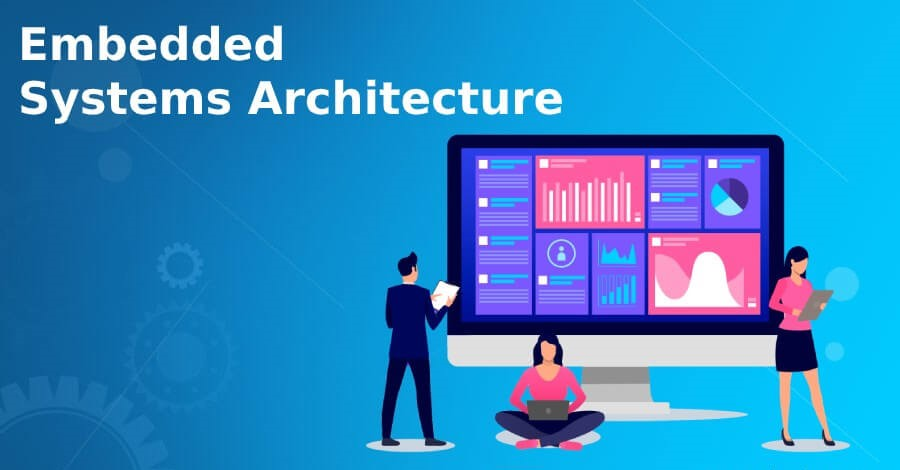

# fictional-carnival
# Hi there, I'm [Hossam Gamal]! 👋

  

## About Me 🚀
I'm not just an **[Embedded System Engineer & Front-End Developer]**; I'm a tech enthusiast with a passion for **[C, Microcontroller 8051, Arm, ROTS, Python, JavaScript, HTML, CSS, React.js]**. 

🌟 I thrive on conquering complex challenges, always on the lookout for opportunities to learn and grow. Collaboration is my superpower, and I enjoy working with diverse teams to craft innovative solutions.

🌱 Currently exploring: **[Embedded System Interfacing]**
🔭 Currently working on: **[Freelance Projects]**
🌍 Fluent in: **[English]**
📫 Reach out to me at: **[hossamjamalelhelw@gmail.com]**

## My Skills 🧠

*Replace the above skill badges with your own skills and expertise. To create more badges, use [checkout this repo](https://github.com/alexandresanlim/Badges4-README.md-Profile).*

## Featured Projects 💻

### [Project 1 Title](project_1_link)

**[Project 1 Title]** is a **[brief project description]** built with **[technologies used]**. This project demonstrates my ability to **[skills demonstrated by the project]**. You can check out the repository [here](project_1_repository_link).

### [Project 2 Title](project_2_link)

**[Project 2 Title]** is a **[brief project description]** built with **[technologies used]**. This project showcases my skills in **[skills demonstrated by the project]**. You can check out the repository [here](project_2_repository_link).

## Get in Touch 📬
- [LinkedIn](https://www.linkedin.com/in/hossam-gamal-810b74220)
- [Email: hossamjamalelhelw@gmail.com](mailto:hossamjamalelhelw@gmail.com)
- [Email: hossamgamal1761@gmail.com](mailto:hossamgamal1761@gmail.com)

