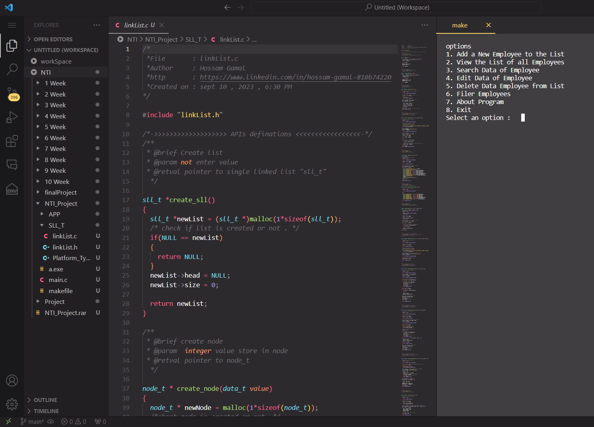
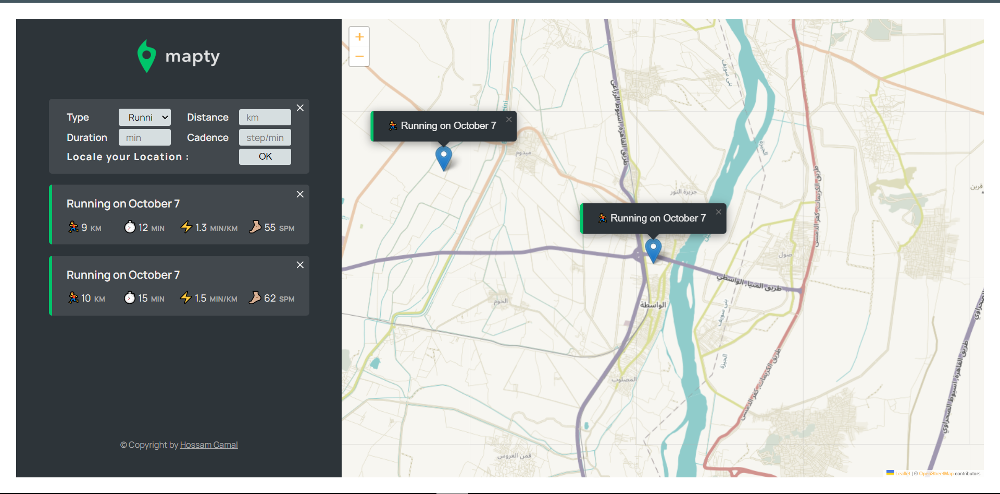

# fictional-carnival
# Hi there, I'm [Hossam Gamal]! 👋

  

## About Me 🚀

I'm an **[Embedded System Engineer & Front-End Developer]**; I'm a tech enthusiast with a passion for **[C, Microcontroller 8051, Arm, ROTS, Python, JavaScript, HTML, CSS, React.js]**.

🌟 I thrive on conquering complex challenges, always on the lookout for opportunities to learn and grow. Collaboration is my superpower, and I enjoy working with diverse teams to craft innovative solutions.

- 🌱 Currently exploring: **[Embedded System Interfacing]**
- 🔭 Currently working on: **[Freelance Projects]**
- 🌍 Fluent in: **[English]**
- 📫 Reach out to me at: **[hossamjamalelhelw@gmail.com]**

## My Skills 🧠

## Featured Projects 💻

### [Employees Management](https://github.com/HossamGamalElhelw/Employees-Management)

**[Employees Management]** is a **[Employee Management System
This program allows you to manage a list of employees.
You can perform the following options:
1. Add a new employee to the list.
2. View the list of all employees.
3. Search Employee Data: Find and display information about a specific employee.
4. Edit Employee Data: Modify the data of employee.
5. Delete Employee Data: Remove an employee from the list.
6. Filter Employees by Salary: View employees with a salary above a specified minimum.
7. Exit: Quit the program.** built with **[C , single Linked List , Makefile]**.

### [Mapty](https://github.com/HossamGamalElhelw/Mapty)

**[Mapty]** is a **[The project "Mapty" is a cool and innovative application that allows users to pinpoint their location on a map and track their running or cycling activities. With Mapty, you can not only mark your starting and ending points but also keep a record of the distance covered, the duration of your trip, and even your cadence.  ]** built with **[HTML , CSS ,JavaScript , Mapping and Location Services ,APIs ,Security,Testing and Quality Assurance**]**. [Live Demo](https://hossamgamalelhelw.github.io/Mapty/)

## Get in Touch 📬
- [LinkedIn](https://www.linkedin.com/in/hossam-gamal-810b74220)
- [Email: hossamjamalelhelw@gmail.com](mailto:hossamjamalelhelw@gmail.com)
- [Email: hossamgamal1761@gmail.com](mailto:hossamgamal1761@gmail.com)

